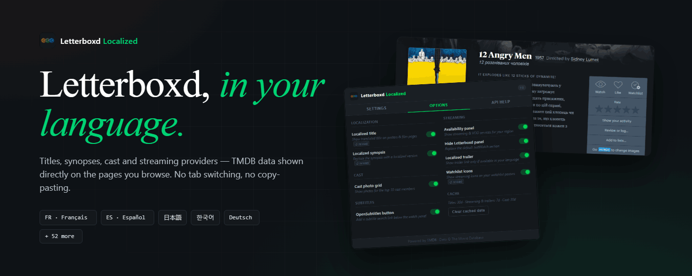
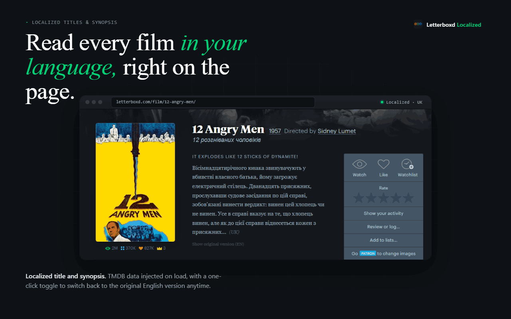
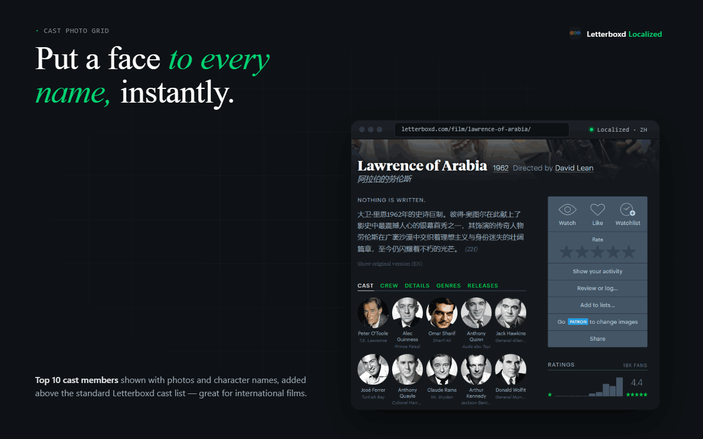
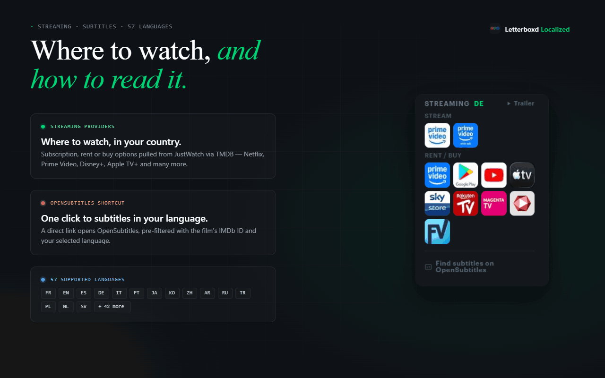
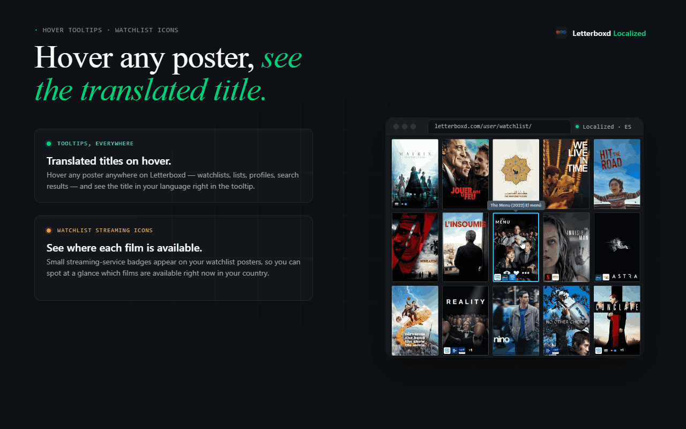
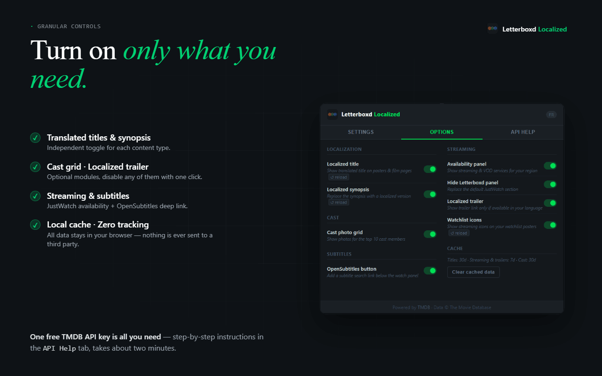

# Letterboxd Localized

> Letterboxd in your language — localized titles, synopsis, streaming availability & cast photos, powered by TMDB.

[](https://chromewebstore.google.com/detail/aecmklmcnonbjfahcgelmgimoagmfnab)

**[→ Install on Chrome Web Store](https://chromewebstore.google.com/detail/aecmklmcnonbjfahcgelmgimoagmfnab?utm_source=item-share-cb)**



**Letterboxd Localized** transforms your Letterboxd experience if English isn't your first language.

Letterboxd is an incredible platform — but all titles, synopses and metadata are displayed in English by default. This extension connects to The Movie Database (TMDB) to automatically fetch localized data in your language and inject it directly into Letterboxd, without any extra clicks.

---

## 🌍 Core features — Localization

- **Localized titles** — The localized title of each film appears on posters (on hover) and on film pages, so you always know what you're looking at in your own language.
- **Localized synopsis** — The film's overview is replaced by the version in your language, with a toggle to switch back to the original English at any time.
- **57 languages supported** — French, German, Spanish, Italian, Portuguese, Japanese, Korean, Arabic, Russian, Chinese, Turkish, Polish, and many more — powered by TMDB's full language catalog.



## ✨ Bonus features

- **Cast photo grid** — A visual grid of the top 10 cast members (photos + character names) is added directly to each film page, so you can put faces to names instantly.
- **Streaming availability** — Know where to watch before you commit. The extension adds a panel showing where each film is available to stream, rent or buy in your country (Netflix, Prime Video, Disney+, Apple TV+, and more), sourced from JustWatch via TMDB.
- **Localized trailer** — A direct link to the trailer in your language (when available on YouTube via TMDB).
- **Watchlist streaming icons** — Small streaming service badges appear directly on your watchlist posters, so you can see at a glance which films are available right now.
- **Subtitles shortcut** — A direct link to OpenSubtitles is added to each film page, pre-filtered by language and IMDb ID.






---

## ⚙️ Setup

1. Install the extension from the [Chrome Web Store](https://chromewebstore.google.com/detail/aecmklmcnonbjfahcgelmgimoagmfnab?utm_source=item-share-cb)
2. Create a free account on [TMDB](https://www.themoviedb.org/signup)
3. Go to **Settings → API** and request a Developer key
4. Copy the **API Key (v3 auth)** and paste it in the extension popup

> All data is fetched directly from TMDB and cached locally in your browser — no data is ever sent to any third-party server.

---

## 🛠️ Development

```
letterboxd-localized/
├── manifest.json       # MV3 manifest
├── background.js       # Service worker — TMDB API calls & caching
├── content.js          # Content script — DOM injection
├── style.css           # Injected styles
├── options.html        # Extension popup
├── options.js          # Popup logic
└── _locales/           # i18n — 47 languages
```

### Cache TTL
| Data | Duration |
|------|----------|
| Titles & synopsis | 30 days |
| Streaming providers | 7 days |
| Cast credits | 30 days |
| Trailers | 7 days |

---

## 📄 License

MIT — This is an independent fan project, not affiliated with Letterboxd or TMDB.
